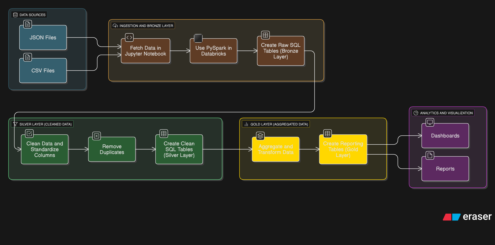

# GameVerse

You’re a data engineer/analyst at GameVerse, a mid-sized game studio that runs an online multiplayer RPG. The studio wants to understand how players engage with the game and how in-game purchases affect revenue based on the data from 3 months ago to now.

Management has asked you to build a data pipeline in Databricks to process raw data from different sources, then deliver clean datasets for the Analytics team (who will use Tableau/Excel).

# Results

- Tableau Dashboard link [here](https://public.tableau.com/app/profile/henrique.felizardo/vizzes)
- Excel Workbook with EDA and storytelling techniques: [here](https://github.com/Henrique-Shiguemoto/GameVerse-Analysis/blob/main/gameverse_eda.xlsx)

# Data Source

Since this is a fictitious case study, the data source is simulated by the script <code>synthetic_data/initial_data_source.py</code>.

It creates three datasets (which simulate databases) and writes them in the <code>notebooks</code> folder:
- Game logs/sessions: Player ID, Session ID, Login Time, Logout Time, Actions and Platform
- Player profiles: Player ID, Country, Age, AccountCreationDate and Gender
- Purchases: Transaction ID, Player ID, Item, Price, Payment Method and Timestamp

These sources are loaded into Databricks which then are used to create the bronze layer for the pipeline. In this layer, pretty much every variable is of type string.

In the silver layer, I clean the data a bit, making sure the tables have consistent column names, converting each column to its correct data type, removing possible duplicate rows, etc.

In the gold layer, tables are joined together for performance of analyses (denormalization) and new tables with aggregated values are created.

Notebooks used to create these layers and queries for visualizations are [here](https://github.com/Henrique-Shiguemoto/GameVerse-Analysis/tree/main/notebooks).

# Data Pipeline Overview

# Technologies Used

- Databricks
- SQL
- Spark/PySpark
- Tableau
- Excel
- Python
